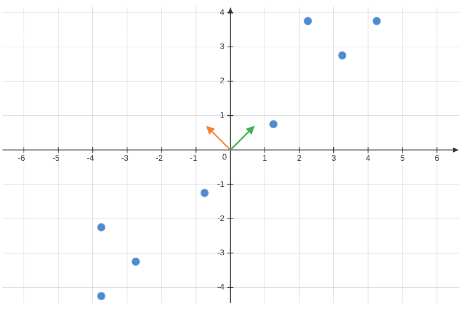

\title{Week-1: Dimensionality Reduction with PCA}
\author{Sherry Thomas \\ 21f3001449}

\maketitle
\tableofcontents

\begin{abstract}
The week provides an introduction to Machine Learning and subsequently delves into the syllabus with a focus on unsupervised learning. The two primary areas of study covered are representation learning and Principal Component Analysis (PCA).
\end{abstract}

# Introduction to Machine Learning
Machine Learning is a sub-field of artificial intelligence concerned with the design of algorithms and statistical models that allow computers to learn from and make predictions or decisions based on data, without being explicitly programmed. It utilizes mathematical optimization, algorithms, and computational models to analyze and understand patterns in data and make predictions about future outcomes.

It can be further explained as follows:

* Why: Machine Learning is used to automate tasks that would otherwise require human intelligence, to process vast amounts of data, and to make predictions or decisions with greater accuracy than traditional approaches. It also has surged in popularity in recent years.
* Where: Machine Learning is applied in various fields such as computer vision, natural language processing, finance, and healthcare, among others.Where: Machine Learning is applied in various fields such as computer vision, natural language processing, finance, and healthcare, among others.
* What: Machine Learning departs from traditional procedural approaches, instead it is driven by data analysis. Rather than memorizing specific examples, it seeks to generalize patterns in the data. Machine Learning is not based on magic, rather it relies on mathematical principles and algorithms.

## Broad Paradigms of Machine Learning

1. **Supervised Learning**:Supervised Machine Learning is a type of machine learning where the algorithm is trained on a labeled dataset, meaning that the data includes both inputs and their corresponding outputs. The goal of supervised learning is to build a model that can accurately predict the output for new, unseen input data. Few examples:
+ Linear regression for predicting a continuous output
+ Logistic regression for binary classification problems
+ Decision trees for non-linear classification and regression problems
+ Support Vector Machines for binary and multi-class classification problems
+ Neural Networks for complex non-linear problems in various domains such as computer vision, natural language processing, and speech recognition
2. **Unsupervised Learning**: Unsupervised Machine Learning is a type of machine learning where the algorithm is trained on an unlabeled dataset, meaning that only the inputs are provided and no corresponding outputs. The goal of unsupervised learning is to uncover patterns or relationships within the data without any prior knowledge or guidance. Few examples:
* Clustering algorithms such as K-means, hierarchical clustering, and density-based clustering, used to group similar data points together into clusters
* Dimensionality reduction techniques such as Principal Component Analysis (PCA), used to reduce the number of features in a dataset while preserving the maximum amount of information
* Anomaly detection algorithms used to identify unusual data points that deviate from the normal patterns in the data
3. **Sequential learning**: Sequential Machine Learning (also known as time-series prediction) is a type of machine learning that is focused on making predictions based on sequences of data. It involves training the model on a sequence of inputs, such that the predictions for each time step depend on the previous time steps. Few examples:
* Time series forecasting, used to predict future values based on past trends and patterns in data such as stock prices, weather patterns, and energy consumption
* Speech recognition, used to transcribe speech into text by recognizing patterns in audio signals
* Natural language processing, used to analyze and make predictions about sequences of text data

# Representation Learning

Representation learning is a fundamental sub-field of machine learning that is concerned with acquiring meaningful and compact representations of intricate data, facilitating various tasks such as dimensionality reduction, clustering, and classification.

Let us consider a dataset $\{\mathbf{x}_1, \mathbf{x}_2, \ldots, \mathbf{x}_n\}$, where each $\mathbf{x}_i \in \mathbb{R}^{d}$. The objective is to find a representation that minimizes the reconstruction error.

We can start by seeking the best linear representation of the dataset, denoted by $\mathbf{w}$, subject to the constraint $||\mathbf{w}||=1$.

The representation is given by,
\begin{align*}
    \frac{(\mathbf{x}_i^T\mathbf{w})}{\mathbf{w}^T\mathbf{w}}&\mathbf{w} \\
    \text{However, }||\mathbf{w}||&=1\\
    \therefore \text{ Projection } &= (\mathbf{x}_i^T\mathbf{w})\mathbf{w}
\end{align*}

The reconstruction error is computed as follows,
$$
\text{Reconstruction Error}(f(\mathbf{w})) = \frac{1}{n} \sum _{i=1} ^{n} || \mathbf{x}_i - (\mathbf{x}_i^T\mathbf{w})\mathbf{w} || ^ 2
$$
where $\mathbf{x}_i - (\mathbf{x}_i^T\mathbf{w})\mathbf{w}$ is termed the residue and can be represented as $\mathbf{x}'$.

The primary aim is to minimize the reconstruction error, leading to the following optimization formulation:
\begin{align*}
    \min _{\mathbf{w} \in ||\mathbf{w}|| = 1} f(\mathbf{w}) &= \frac{1}{n} \sum _{i=1} ^{n} -(\mathbf{x}_i^T\mathbf{w})^2 \\
    \therefore \max _{\mathbf{w} \in ||\mathbf{w}|| = 1} f(\mathbf{w}) &= \frac{1}{n} \sum _{i=1} ^{n} (\mathbf{x}_i^T\mathbf{w})^2 \\
    &= \mathbf{w}^T(\frac{1}{n} \sum _{i=1} ^{n} \mathbf{x}_i\mathbf{x}_i^T)\mathbf{w} \\
    \max _{\mathbf{w} \in ||\mathbf{w}|| = 1} f(\mathbf{w}) &= \mathbf{w}^T\mathbf{C}\mathbf{w}
\end{align*}
where $\mathbf{C}=\displaystyle \frac{1}{n} \displaystyle \sum _{i=1} ^{n} \mathbf{x}_i\mathbf{x}_i^T$ represents the Covariance Matrix, and $\mathbf{C} \in \mathbb{R}^{d \times d}$.

Notably, the eigenvector $\mathbf{w}$ corresponding to the largest eigenvalue $\lambda$ of $\mathbf{C}$ becomes the sought-after solution for the representation. This $\mathbf{w}$ is often referred to as the First Principal Component of the dataset.

\pagebreak
## Potential Algorithm

Based on the above concepts, we can outline the following algorithm for representation learning:

Given a dataset $\{\mathbf{x}_1, \mathbf{x}_2, \ldots, \mathbf{x}_n\}$ where $\mathbf{x}_i \in \mathbb{R}^{d}$,

1. Center the dataset:
$$
\mathbf{\mu} = \frac{1}{n} \sum _{i=1} ^{n} \mathbf{x}_i
$$
$$
\mathbf{x}_i = \mathbf{x}_i - \mathbf{\mu}  \hspace{2em} \forall i
$$

2. Find the best representation $\mathbf{w} \in \mathbb{R}^d$ with $||\mathbf{w}|| = 1$.

3. Update the dataset with the representation:
$$
\mathbf{x}_i = \mathbf{x}_i - (\mathbf{x}_i^T\mathbf{w})\mathbf{w}  \hspace{1em} \forall i
$$

4. Repeat steps 2 and 3 until the residues become zero, resulting in $\mathbf{w}_2, \mathbf{w}_3, \ldots, \mathbf{w}_d$.

The question arises: Is this the most effective approach, and how many $\mathbf{w}$ do we need to achieve optimal compression?

# Principal Component Analysis

Principal Component Analysis (PCA) is a powerful technique employed to reduce the dimensionality of a dataset by identifying its most important features, known as principal components, which explain the maximum variance present in the data. PCA achieves this by transforming the original dataset into a new set of uncorrelated variables, ordered by their significance in explaining the variance. This process is valuable for visualizing high-dimensional data and preprocessing it before conducting machine learning tasks.

Following the potential algorithm mentioned earlier and utilizing the set of eigenvectors $\{\mathbf{w}_1, \mathbf{w}_2, \ldots, \mathbf{w}_d\}$, we can express each data point $\mathbf{x}_i$ as a linear combination of the projections on these eigenvectors:
$$
\forall i \hspace{1em} \mathbf{x}_i - ((\mathbf{x}_i^T\mathbf{w}_1)\mathbf{w}_1 + (\mathbf{x}_i^T\mathbf{w}_2)\mathbf{w}_2 + \ldots +(\mathbf{x}_i^T\mathbf{w}_d)\mathbf{w}_d) = 0
$$
$$
\therefore \mathbf{x}_i = (\mathbf{x}_i^T\mathbf{w}_1)\mathbf{w}_1 + (\mathbf{x}_i^T\mathbf{w}_2)\mathbf{w}_2 + \ldots +(\mathbf{x}_i^T\mathbf{w}_d)\mathbf{w}_d
$$

From the above equation, we observe that we can represent the data using constants $\{\mathbf{x}_i^T\mathbf{w}_1, \mathbf{x}_i^T\mathbf{w}_2, \ldots, \mathbf{x}_i^T\mathbf{w}_d\}$ along with vectors $\{\mathbf{w}_1, \mathbf{w}_2, \ldots, \mathbf{w}_d\}$.

Thus, a dataset initially represented as $d \times n$ can now be compressed to $d (d + n)$ elements, which might seem suboptimal at first glance.

However, if the data resides in a lower-dimensional subspace, the residues can be reduced to zero without requiring all $d$ principal components. Suppose the data can be adequately represented using only $k$ principal components, where $k \ll d$. In that case, the data can be efficiently compressed from $d \times n$ to $k(d + n)$.

## Approximate Representation

The question arises: If the data can be approximately represented by a lower-dimensional subspace, would it suffice to use only those $k$ projections? Additionally, how much variance should be covered?

Let us consider a centered dataset $\{\mathbf{x}_1, \mathbf{x}_2, \ldots, \mathbf{x}_n\}$ where $\mathbf{x}_i \in \mathbb{R}^{d}$. Let $\mathbf{C}$ represent its covariance matrix, and $\{\lambda_1, \lambda_2, \ldots, \lambda_d \}$ be the corresponding eigenvalues, which are non-negative due to the positive semi-definiteness of the covariance matrix. These eigenvalues are arranged in descending order, with $\{\mathbf{w}_1, \mathbf{w}_2, \ldots, \mathbf{w}_d \}$ as their corresponding eigenvectors of unit length.

The eigen equation for the covariance matrix can be expressed as follows:
\begin{align*}
    \mathbf{C}\mathbf{w} &= \lambda \mathbf{w} \\
    \mathbf{w}^T\mathbf{C}\mathbf{w} &= \mathbf{w}^T\lambda \mathbf{w}\\
    \therefore \lambda &= \mathbf{w}^T\mathbf{C}\mathbf{w} \hspace{2em} \{\mathbf{w}^T\mathbf{w} = 1\} \\
    \lambda &= \frac{1}{n} \sum _{i=1} ^{n} (\mathbf{x}_i^T\mathbf{w})^2 \\
\end{align*}

Hence, the mean of the dataset being zero, $\lambda$ represents the variance captured by the eigenvector $\mathbf{w}$.

A commonly accepted heuristic suggests that PCA should capture at least 95\% of the variance. If the first $k$ eigenvectors capture the desired variance, it can be stated as:
$$
\frac{\displaystyle \sum _{j=1} ^{k} \lambda_j}{\displaystyle \sum _{i=1} ^{d} \lambda_i} \ge 0.95
$$ 

Thus, the higher the variance captured, the lower the error incurred.

\pagebreak
## P.C.A. Algorithm

The Principal Component Analysis algorithm can be summarized as follows for a centered dataset $\{\mathbf{x}_1, \mathbf{x}_2, \ldots, \mathbf{x}_n\}$ where $\mathbf{x}_i \in \mathbb{R}^{d}$, and $\mathbf{C}$ represents its covariance matrix:

* **Step 1**: Find the eigenvalues and eigenvectors of $\mathbf{C}$. Let $\{\lambda_1, \lambda_2, \ldots, \lambda_d \}$ be the eigenvalues arranged in descending order, and $\{\mathbf{w}_1, \mathbf{w}_2, \ldots, \mathbf{w}_d \}$ be their corresponding eigenvectors of unit length.

* **Step 2**: Calculate $k$, the number of top eigenvalues and eigenvectors required, based on the desired variance to be covered.

* **Step 3**: Project the data onto the eigenvectors and obtain the desired representation as a linear combination of these projections.

In essence, PCA is a dimensionality reduction technique that identifies feature combinations that are de-correlated (independent of each other).

# Acknowledgments

**Professor Arun Rajkumar**: The content, including the concepts and notations presented in this document, has been sourced from his slides and lectures.

**ChatGPT**: The AI language model used in this document has made corrections and improvements to the notations and language, ensuring clarity and accuracy in the presentation of the material. Its capabilities have enhanced the overall quality and readability of this document.