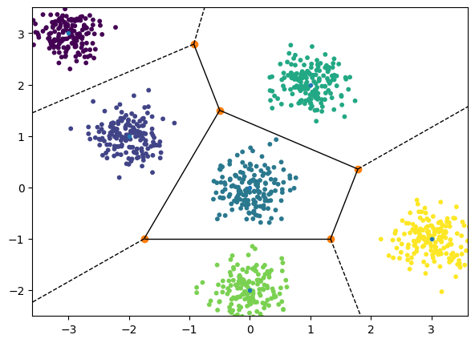

\title{MLT Week-3}
\author{Sherry Thomas (21f3001449), Vivek Sivaramakrishnan (21f2000045)}

\maketitle
\tableofcontents

\begin{abstract}
The week commences with an introduction to the concept of clustering and a comprehensive examination of the K-means algorithm, a crucial element within the topic. The week also delves into the constraints of the K-means approach and offers potential remedial measures to address such limitations.
\end{abstract}

# Introduction to Clustering
Clustering is a method of unsupervised machine learning that groups similar objects into clusters, discovering structure in data for exploratory analysis or as a pre-processing step for other algorithms.

Our objective is to group $n$ datapoints into $k$ clusters.

Notation:
$$
\mathbf{X}=\{\mathbf{x}_1, \mathbf{x}_2, \dots, \mathbf{x}_n \} \quad \mathbf{x}_i \in \mathbb{R}^d 
$$
$$
S = \{\mathbf{z} \quad \forall \mathbf{z} \in \{1, 2, \ldots k\}^n \}
$$
$$
\boldsymbol{\mu} _k = \frac{\displaystyle \sum _{i = 1} ^{n} {\mathbf{x}_i \cdot \mathbb{1}(z_i=k)}}{\displaystyle \sum _{i = 1} ^{n} {\mathbb{1}(z_i=k)}}
$$

Where:

- $\mathbf{x}_i$ denotes the $i^{th}$ datapoint
- $z_i$ denotes the cluster indicator of $\mathbf{x}_i$
- $\boldsymbol{\mu}_{z_i}$ denotes the mean of the cluster with indicator $z_i$
- $S$ denotes the set of all possible cluster assignments. Note that S is **finite** ($k^n$).

**Goal**:
$$
\min _{\mathbf{z} \in S} \sum _{i=1} ^{n} {|| \mathbf{x}_i - \boldsymbol{\mu} _{z_i} ||}^2
$$
Unfortunately, finding a solution manually is an [NP-Hard](https://en.wikipedia.org/wiki/NP-hardness) problem, and can be solved by iterating through all the $k^n$ possibilities. Due to computational constraints, alternative approaches to approximate the solution to the NP-Hard problem, must be considered.

# K-means Clustering (Lloyd's Algorithm)
Lloyd's Algorithm, also known as the k-means algorithm, is a widely used and straightforward method for clustering that divides a dataset into $K$ pre-determined clusters by iteratively computing the mean distance between the points and their cluster centroids.

## The Algorithm
The algorithm is as follows:

**Step 1: Initialization**: Assign *random* datapoints from the dataset as the cluster centers
    
**Step 2: Reassignment Step**:
$$
z _i ^{t} = \underset{k}{\arg \min} {|| \mathbf{x}_i - \boldsymbol{\mu} _{k} ^t ||}_2 ^2 \hspace{2em} \forall i
$$

**Step 3: Compute Means**:
$$
\boldsymbol{\mu} _k ^{t+1} = \frac{\displaystyle \sum _{i = 1} ^{n} {\mathbf{x}_i \cdot \mathbb{1}(z_i^t=k)}}{\displaystyle \sum _{i = 1} ^{n} {\mathbb{1}(z_i^t=k)}} \hspace{2em} \forall k
$$

**Step 4: Loop until Convergence**:
Repeat steps 2 and 3 until the cluster assignments do not change.

\pagebreak
# Convergence of K-means Algorithm
**Convergence** in accordance to the objective is established, since the following can be shown:

- The set of all possible cluster assignments $S$ is **finite**.
- The objective function value strictly decreases after every iteration of Lloyd's.
$$
F(z_1^{t+1}, z_2^{t+1}, \ldots, z_n^{t+1}) < F(z_1^{t}, z_2^{t}, \ldots, z_n^{t})
$$

The initialization for K-Means can be done in *smarter* ways than a random initialization - which improve the chance of Lloyd's converging to a good cluster assignment; with a lesser number of iterations.

It is important to note that the final assignment need not necessarily be the best answer (global optima) to the objective function, but it is good enough in practice.
The objective function strictly reduces after each reassignment.

And as there are only finite number of possibilities of assignments ($k^n$), the algorithm must converge.

**Alternate Explanation**: K-means algorithm converges because it is an iterative procedure that minimizes the sum of squared distances between points and their cluster centroids, which is a convex function with a global minimum. The algorithm will reach the convergence point, guaranteed to exist, under mild assumptions on the initial cluster means, making it a reliable tool for clustering.

\pagebreak
# Nature of Clusters Produced by K-means
Let $\boldsymbol{\mu}_1$ and $\boldsymbol{\mu}_2$ be the centroids of the clusters $C_1$ and $C_2$ respectively.

For $C_1$,
\begin{align*}
    {|| \mathbf{x} - \boldsymbol{\mu} _{1} ||}^2 &\le {|| \mathbf{x} - \boldsymbol{\mu} _{2} ||}^2 \\
    \therefore \mathbf{x}^T(\boldsymbol{\mu} _2 - \boldsymbol{\mu} _1) &\le \frac{||\boldsymbol{\mu} _2||^2 - ||\boldsymbol{\mu} _1||^2}{2} \hspace{2em} \forall \mathbf{x}
\end{align*}

Note that the above equation is of the form $\mathbf{x}^T(w)<c$ -  which indicates a linear seperator - or a half-space. Therefore, our resulting partition of the region is an intersection of multiple half-spaces - also called a Voronoi Partition.

\pagebreak
But what if the dataset is as follows:

The standard k-means algorithm may not perform well when the underlying clusters in the dataset have a non-linear structure. In such cases, alternative methods such as Kernel K-means or Spectral Clustering can be employed to improve clustering accuracy. However, the intricacies of these methods will not be covered in this course.

\pagebreak
# Smart Initialization - K-means++

The premise is to select centroids that are as far as possible from each other.

* Step 1: Choose $\boldsymbol{\mu} _1 ^0$ randomly from the dataset.
* Step 2: For $l \in \{2, 3, \ldots, k\}$, choose $\boldsymbol{\mu} _l ^0$ probablistically proportional to score($S$) where $S$ is,
$$
    S(\mathbf{x}_i) = \min _{\{j=1, 2, \ldots, l-1\}} {|| \mathbf{x}_i - \boldsymbol{\mu} _{j} ^0 ||}^2 \quad \forall \mathbf{x}_i \in \mathbf{X}
$$
    The probabilistic aspect of the algorithm provides an expected guarantee of optimal convergence in K-means. The guarantee is given by,
$$
    \mathbb{E} \left[ \sum _{i=1} ^{n} {|| \mathbf{x}_i - \boldsymbol{\mu} _{z_i} ||}^2 \right ]
    \le O(\log k) \left [ \min _{\{z_1, z_2, \ldots, z_n\}} \sum _{i=1} ^{n} {|| \mathbf{x}_i - \boldsymbol{\mu} _{z_i} ||}^2 \right ]
$$
    where $O(\log k)$ is a constant of order $\log k$.
* Step 3: Once the centroids are determined, we proceed with our usual Lloyd's Algorithm.

# Choice of K
A pre-requisite of K-means is $k$ or the number of clusters. But what if $k$ is unknown? 

If $k$ is chosen to be $n$,
$$
F(z_1, z_2, \dots, z_n) = \sum _{i=1} ^{n} {|| \mathbf{x}_i - \boldsymbol{\mu} _{z_i} ||} ^2 = 0
$$
But we don't want as many clusters as datapoints. Therefore, $k$ needs to be as small as possible. We do this by penalizing large values of $k$.
$$
\underset{k}{\arg \min} \left [ \sum _{i=1} ^{n} {|| \mathbf{x}_i - \boldsymbol{\mu} _{z_i} ||} ^2 + \text{Penalty}(k) \right ]
$$
Two common criteria for making the above argument:

* [$\text{\textcolor{blue}{Akaike Information Criterion}}$](https://en.wikipedia.org/wiki/Akaike_information_criterion): $\left [ 2K - 2\ln(\hat{\mathcal{L}}(\theta ^*)) \right ]$
* [$\text{\textcolor{blue}{Bayesian Information Criterion}}$](https://en.wikipedia.org/wiki/Bayesian_information_criterion): $\left [ K\ln(n) - 2\ln(\hat{\mathcal{L}}(\theta ^*)) \right ]$

Details for the same are not covered in this course.

# Credits
* Professor Arun Rajkumar: The content as well as the notations are from his slides and lecture.