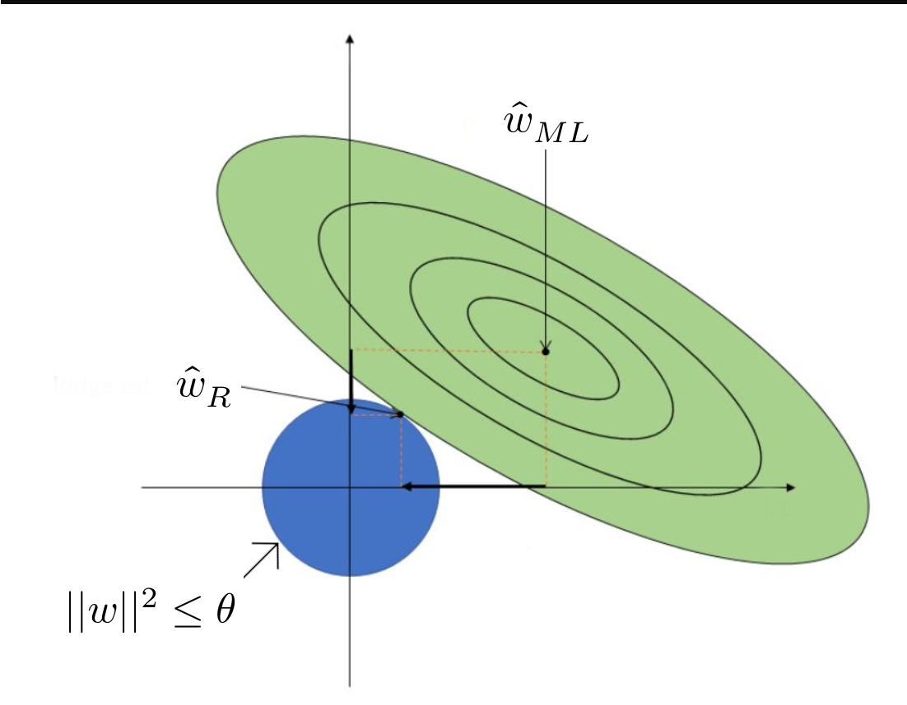
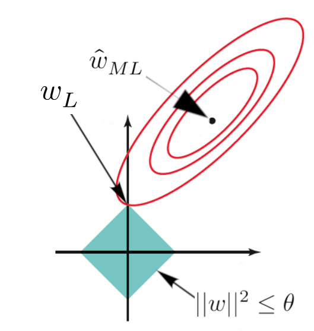

\title{Week-6: Regression and Regularization Techniques}
\author{Sherry Thomas \\ 21f3001449}

\maketitle
\tableofcontents

\begin{abstract}
In this week's discussion on Linear Regression, we explore various techniques to minimize Mean Squared Error (MSE) and delve into the concepts of Ridge and Lasso regression. These methods aim to optimize the performance of the linear regression model and improve its predictive power.
\end{abstract}

# Evaluation of the Maximum Likelihood Estimator for Linear Regression

## Introduction
Linear regression is a widely used technique for modeling the relationship between a dependent variable and one or more independent variables. The maximum likelihood estimator (MLE) is commonly employed to estimate the parameters of a linear regression model. Here, we discuss the goodness of the MLE for linear regression, explore cross-validation techniques to minimize mean squared error (MSE), examine Bayesian modeling as an alternative approach, and finally, delve into ridge and lasso regression as methods to mitigate overfitting.

# Goodness of Maximum Likelihood Estimator for Linear Regression

Consider a dataset comprising input vectors $\{\mathbf{x}_1, \ldots, \mathbf{x}_n\}$, where each $\mathbf{x}_i \in \mathbb{R}^d$, and corresponding labels $\{y_1, \ldots, y_n\}$, with $y_i \in \mathbb{R}$. We can express the relationship between the inputs and labels using the linear regression model:

$$
y|\mathbf{X} = \mathbf{w}^T\mathbf{x} + \epsilon
$$

Here, $\epsilon$ represents the random noise following a normal distribution $\mathcal{N}(0,\sigma^2)$, and $\mathbf{w} \in \mathbb{R}^d$ denotes the regression coefficients. The maximum likelihood parameter estimation for linear regression, denoted as $\hat{\mathbf{w}}_{\text{ML}}$, can be computed as:

$$
\hat{\mathbf{w}}_{\text{ML}} = \mathbf{w}^* = (\mathbf{X}\mathbf{X}^T)^+\mathbf{X}\mathbf{y}
$$

To evaluate the quality of the estimated parameters, we measure the mean squared error (MSE) between the estimated parameters and the true parameters $\mathbf{w}$. The MSE is given by:

$$
\mathbb{E}[|| \hat{\mathbf{w}}_{\text{ML}} - \mathbf{w} ||^2_2]
$$

Interestingly, the MSE can be expressed as:

$$
\mathbb{E}[|| \hat{\mathbf{w}}_{\text{ML}} - \mathbf{w} ||^2_2] = \sigma^2 \cdot \text{trace}((\mathbf{X}\mathbf{X}^T)^{-1})
$$

This result provides a quantitative measure of the goodness of the maximum likelihood estimator for linear regression.

\pagebreak
# Cross-Validation for Minimizing MSE

In order to minimize the MSE, we can utilize cross-validation techniques. Let the eigenvalues of $\mathbf{X}\mathbf{X}^T$ be denoted as $\{\lambda_1, \ldots, \lambda_d\}$. Consequently, the eigenvalues of $(\mathbf{X}\mathbf{X}^T)^{-1}$ are given by $\{\frac{1}{\lambda_1}, \ldots, \frac{1}{\lambda_d}\}$.

The MSE can be expressed as:

$$
\mathbb{E}[|| \hat{\mathbf{w}}_{\text{ML}} - \mathbf{w} ||^2_2] = \sigma^2 \sum_{i=1}^d \frac{1}{\lambda_i}
$$

To improve the estimator, we introduce a modified estimator, denoted as $\hat{\mathbf{w}}_{\text{new}}$, defined as:

$$
\hat{\mathbf{w}}_{\text{new}} = (\mathbf{X}\mathbf{X}^T + \lambda \mathbf{I})^{-1}\mathbf{X}\mathbf{y}
$$

Here, $\lambda \in \mathbb{R}$ and $\mathbf{I} \in \mathbb{R}^{d\times d}$ represents the identity matrix. By utilizing this modified estimator, we can calculate:

$$
\text{trace}((\mathbf{X}\mathbf{X}^T + \lambda \mathbf{I})^{-1}) = \sum_{i=1}^d \frac{1}{\lambda_i + \lambda}
$$

According to the Existence Theorem, there exists a value of $\lambda$ such that $\hat{\mathbf{w}}_{\text{new}}$ exhibits a lower mean squared error than $\hat{\mathbf{w}}_{\text{ML}}$. In practice, the value for $\lambda$ is determined using cross-validation techniques.

Three commonly used techniques for cross-validation are as follows:

1. **Training-Validation Split**: The training set is randomly divided into a training set and a validation set, typically in an 80:20 ratio. Among various $\lambda$ values, the one that yields the lowest error is selected.

2. **K-Fold Cross Validation**: The training set is partitioned into K equally-sized parts. The model is trained K times, each time using K-1 parts as the training set and the remaining part as the validation set. The $\lambda$ value that leads to the lowest average error is chosen.

3. **Leave-One-Out Cross Validation**: The model is trained using all but one sample in the training set, and the left-out sample is used for validation. This process is repeated for each sample in the dataset. The optimal $\lambda$ is determined based on the average error across all iterations.

By employing cross-validation techniques, we can enhance the performance of the linear regression model by selecting an appropriate value of $\lambda$.

\pagebreak
# Bayesian Modeling

Alternatively, we can understand the maximum likelihood estimator $\hat{\mathbf{w}}_{\text{ML}}$ in the context of Bayesian modeling.

Assume that $P(y|\mathbf{X})$ follows a normal distribution $\mathcal{N}(\mathbf{w}^T\mathbf{x},\mathbf{I})$, where $I$ represents the identity matrix for simplicity.

For the prior distribution of $\mathbf{w}$, a suitable choice is the normal distribution $\mathcal{N}(0,\gamma^2\mathbf{I})$, where $\gamma^2\mathbf{I} \in\mathbb{R}^{d\times d}$.

Thus, we can write:

\begin{align*}
P(\mathbf{w}|\{(\mathbf{x}_1, y_1), \ldots, (\mathbf{x}_n,y_n)\}) &\propto P(\{(\mathbf{x}_1, y_1), \ldots, (\mathbf{x}_n,y_n)\}|\mathbf{w})*P(\mathbf{w}) \\
&\propto \left ( \prod_{i=1}^n e^{\frac{-(y_i - \mathbf{w}^T\mathbf{x}_i)^2}{2}}  \right ) * \left ( \prod_{i=1}^d  e^{\frac{-(\mathbf{w}_i - 0)^2}{2\gamma^2}} \right ) \\
&\propto \left ( \prod_{i=1}^n e^{\frac{-(y_i - \mathbf{w}^T\mathbf{x}_i)^2}{2}}  \right ) * e^{\frac{-||\mathbf{w}||^2}{2\gamma^2}}
\end{align*}

Taking the logarithm, we obtain:

$$
\log(P(\mathbf{w}|\{(\mathbf{x}_1, y_1), \ldots, (\mathbf{x}_n,y_n)\})) \propto \frac{-(y_i - \mathbf{w}^T\mathbf{x}_i)^2}{2}-\frac{||\mathbf{w}||^2}{2\gamma^2}
$$

Upon computing the gradient, we find:

$$
\nabla \log(P(\mathbf{w}|\{(\mathbf{x}_1, y_1), \ldots, (\mathbf{x}_n,y_n)\})) \propto  (\mathbf{X}\mathbf{X}^T)\hat{\mathbf{w}}_{\text{MAP}} - \mathbf{X}\mathbf{y} + \frac{\hat{\mathbf{w}}_{\text{MAP}}}{\gamma^2}
$$

Consequently, the maximum a posteriori estimate (MAP) for $\mathbf{w}$ can be computed as:

$$
\hat{\mathbf{w}}_{\text{MAP}} = (\mathbf{X}\mathbf{X}^T + \frac{1}{\gamma^2} \mathbf{I})^{-1}\mathbf{X}\mathbf{y}
$$

In practice, the value of $\frac{1}{\gamma^2}$ is obtained using cross-validation. Remarkably, this maximum a posteriori estimation for linear regression with a Gaussian prior $\mathcal{N}(0,\gamma^2\mathbf{I})$ for $\mathbf{w}$ is equivalent to the modified estimator $\hat{\mathbf{w}}_{\text{new}}$ discussed earlier.

\pagebreak
# Ridge Regression

Ridge regression is a linear regression technique that addresses multicollinearity and overfitting by adding a penalty term to the ordinary least squares method.

The objective function of ridge regression is given by:

$$
\min_{\mathbf{w} \in \mathbb{R}^d} \sum^n_{i=1}(\mathbf{w}^T\mathbf{x}_i-y_i)^2 + \lambda||\mathbf{w}||_2^2
$$

Here, $\lambda||\mathbf{w}||_2^2$ serves as the regularization term, and $||\mathbf{w}||_2^2$ represents the squared L2 norm of $\mathbf{w}$. Let us denote this equation as $f(\mathbf{w})$.

Alternatively, we can express ridge regression as:

$$
\min_{\mathbf{w} \in \mathbb{R}^d} \sum^n_{i=1}(\mathbf{w}^T\mathbf{x}_i-y_i)^2 \hspace{1em}\text{s.t.}\hspace{1em}||\mathbf{w}||_2^2\leq\theta
$$

Here, the value of $\theta$ depends on $\lambda$. We can conclude that for any choice of $\lambda>0$, there exists a corresponding $\theta$ such that optimal solutions to our objective function exist.

The loss function for linear regression with the maximum likelihood estimator $\mathbf{w}_{\text{ML}}$ is defined as:

$$
f(\mathbf{w}_{\text{ML}}) = \sum^n_{i=1}(\mathbf{w}_{\text{ML}}^T\mathbf{x}_i-y_i)^2
$$

Consider the set of all $\mathbf{w}$ such that $f(\mathbf{w}_{\text{ML}}) = f(\mathbf{w}) + c$, where $c>0$. This set can be represented as:

$$
S_c = \left \{\mathbf{w}: f(\mathbf{w}_{\text{ML}}) = f(\mathbf{w}) + c \right \}
$$

In other words, every $\mathbf{w} \in S_c$ satisfies the equation:

$$
||\mathbf{X}^T\mathbf{w}-\mathbf{y}||^2 = ||\mathbf{X}^T\mathbf{w}_{\text{ML}}-\mathbf{y}||^2 + c
$$

Simplifying the equation yields:

$$
(\mathbf{w}-\mathbf{w}_{\text{ML}})^T(\mathbf{X}\mathbf{X}^T)(\mathbf{w}-\mathbf{w}_{\text{ML}}) = c'
$$

The value of $c'$ depends on $c$, $\mathbf{X}\mathbf{X}^T$, and $\mathbf{w}_{\text{ML}}$, but it does not depend on $\mathbf{w}$.

In summary, ridge regression regularizes the feature values, pushing them towards zero, but not necessarily to zero.

# Lasso Regression

Lasso (Least Absolute Shrinkage and Selection Operator) regression is a linear regression technique that employs a regularization approach to shrink the coefficients of less important features to zero. This method effectively performs feature selection and mitigates overfitting.

The objective function of lasso regression is given by:

$$
\min_{\mathbf{w} \in \mathbb{R}^d} \sum^n_{i=1}(\mathbf{w}^T\mathbf{x}_i-y_i)^2 + \lambda||\mathbf{w}||_1^2
$$

Lasso regression is similar to ridge regression, with the key difference being the use of $||\mathbf{w}||_1^2$ instead of $||\mathbf{w}||_2^2$, representing the squared L1 norm of $\mathbf{w}$.

Lasso regression does not have a closed-form solution and is often solved using sub-gradients. Further information on sub-gradients can be found [here](https://see.stanford.edu/materials/lsocoee364b/01-subgradients_notes.pdf).

In conclusion, lasso regression shrinks the coefficients of less important features to exactly zero, enabling feature selection.

# Acknowledgments

**Professor Arun Rajkumar**: The content, including the concepts and notations presented in this document, has been sourced from his slides and lectures. His expertise and educational materials have greatly contributed to the development of this document.
