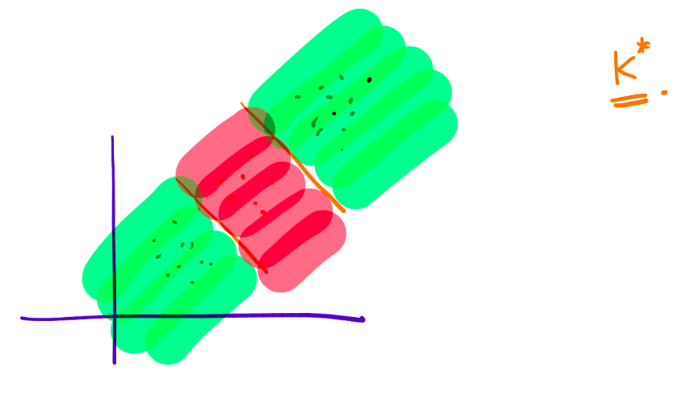

\title{MLT Week-7}
\author{Sherry Thomas \\ 21f3001449}

\maketitle
\tableofcontents

\begin{abstract}
This week examines the primary methods of binary classification, namely linear classifiers, K-nearest neighbor (K-NN) algorithm, and decision trees. The advantages and disadvantages of each approach are comprehensively discussed, alongside their efficient implementation.
\end{abstract}

# Introduction to Binary Classification

Binary classification is a fundamental task in machine learning, commonly employed in various domains such as computer vision, natural language processing, and bioinformatics. Its objective is to assign objects into one of two categories based on their features.

Consider a dataset $\{\mathbf{x}_1, \ldots, \mathbf{x}_n\}$, where $\mathbf{x}_i \in \mathbb{R}^d$, and let $\{y_1, \ldots, y_n\}$ be the corresponding labels, where $y_i \in \{0, 1\}$. The goal is to find a function $h: \mathbb{R}^d \rightarrow \{0, 1\}$ that accurately predicts the labels.

To assess the performance of the classification function, a loss measure is employed. The loss function is defined as follows:

$$
\text{loss}(h) = \frac{1}{n} \sum ^n _{i=1}\mathbb{1}\left ( h(\mathbf{x}_i) \ne y_i \right )
$$

Let $\mathcal{H}_{\text{linear}}$ denote the solution space for the linear mapping:

$$
\mathcal{H}_{\text{linear}}=\left\{\mathbf{h}_w: \mathbb{R}^d \rightarrow \{1, 0\} \hspace{0.5em} \text{s.t.} \hspace{0.5em} \mathbf{h}_w(\mathbf{x}) = \text{sign}(\mathbf{w}^T\mathbf{x}) \hspace{0.5em} \forall \mathbf{w} \in \mathbb{R}^d \right\}
$$

Hence, the objective function can be expressed as:

$$
\min_{h \in \mathcal{H}_{\text{linear}}} \sum_{i=1}^n \mathbb{1}\left ( h(\mathbf{x}_i) \ne y_i \right )
$$

However, it is important to note that this objective function presents an NP-Hard problem, making it challenging to find optimal and sufficient parameters. Therefore, improved implementations are required to address this complexity and achieve satisfactory results.

# Linear Classifier

Can linear regression be used to solve the binary classification problem? Let's examine the proposed algorithm:

$$
\{(\mathbf{x}_1, y_1), \ldots, (\mathbf{x}_n,y_n)\} \xrightarrow[Regression]{Linear} \mathbf{w} \in \mathbb{R}^d \rightarrow \mathbf{h}_\mathbf{w}: \mathbb{R}^d \rightarrow \{1, 0\}
$$

However, employing linear regression for classification poses an issue. Consider the following diagram:

Upon closer examination, it becomes evident that linear regression-based classification not only separates the two categories based on their respective sides but also considers their positions. As a consequence, the classification boundary may shift with respect to the outliers in the dataset. Hence, this approach is not suitable for binary classification.

# K-Nearest Neighbors Algorithm

The K-Nearest Neighbors (K-NN) algorithm is a widely-used non-parametric method utilized for both classification and regression tasks in machine learning. It operates by identifying the K-nearest data points to the target object and classifying or regressing the target object based on the majority of its nearest neighbors.

The algorithm follows these steps:

1. Given a test sample $\mathbf{x}_{\text{test}}$, find the $k$ closest points in the training set, denoted as $\{\mathbf{x}_1^*, \mathbf{x}_2^*, \ldots, \mathbf{x}_k^*\}$.
2. Predict the label of the test sample as $y_{\text{test}} = \text{majority}(y_1^*, y_2^*, \ldots, y_k^*)$.

The following diagrams illustrate the impact of the value of $k$ on the classification:

$$
\text{When }k=1\text{, the classification is highly sensitive to outliers.}
$$

$$
\text{When }k=n\text{, the classification becomes overly smooth.}
$$

$$
\text{When }k=k^*\text{, the classification achieves a balanced result.}
$$

The choice of $k$ is typically determined through cross-validation, treating $k$ as a hyperparameter. Smaller values of $k$ lead to more complex classifications.

## Issues with K-NN

The K-NN algorithm suffers from several limitations:

1. The choice of distance function can yield different results. The Euclidean distance, commonly used, might not always be the best fit for all scenarios.
2. Computationally, the algorithm can be demanding. When making predictions for a single test data point, the distances between that data point and all training points must be calculated and sorted. Consequently, the algorithm has a complexity of $O(n \log(n))$, where $n$ represents the size of the dataset.
3. The algorithm does not learn a model but instead relies on the training dataset for making predictions.

# Introduction to Decision Trees

Decision trees are widely used in machine learning for classification and regression tasks. They operate by recursively partitioning the data based on the most informative features until a stopping criterion is met. Decision trees can be visualized as tree-like structures.

Consider a dataset $\{\mathbf{x}_1, \ldots, \mathbf{x}_n\}$, where $\mathbf{x}_i \in \mathbb{R}^d$, and let $\{y_1, \ldots, y_n\}$ be the corresponding labels, where $y_i \in \{0, 1\}$. The output of the decision tree algorithm is a constructed decision tree.

Prediction: Given a test sample $\mathbf{x}_{\text{test}}$, we traverse the decision tree to reach a leaf node, and the label assigned to the leaf node is considered as $y_{\text{test}}$.

The following diagram depicts a decision tree:

Here, a **question** refers to a (feature, value) pair. For example, $height \le 180\text{cm}$?

## Goodness of a Question

To evaluate the quality of a question, we need a measure of "impurity" for a set of labels $\{y_1, \ldots, y_n\}$. Various measures can be employed, but we will use the **Entropy** function.

The Entropy function is defined as:

$$
\text{Entropy}(\{y_1, \ldots, y_n\}) = \text{Entropy}(p) = -\left( p\log(p)+(1-p)\log(1-p) \right )
$$

Here, $\log(0)$ is conventionally treated as $0$.

Pictorial representation of the Entropy function:

Information Gain is then utilized to measure the quality of a split in the decision tree algorithm.

**Information gain** is a commonly used criterion in decision tree algorithms that quantifies the reduction in entropy or impurity of a dataset after splitting based on a given feature. High information gain signifies features that effectively differentiate between the different classes of data and lead to accurate predictions.

Information gain is calculated as:

$$
\text{Information Gain}(\text{feature}, \text{value}) = \text{Entropy}(D) - \left[\gamma \cdot \text{Entropy}(D_{\text{yes}}) + (1-\gamma) \cdot \text{Entropy}(D_{\text{no}}) \right]
$$

where $\gamma$ is defined as:

$$
\gamma = \frac{|D_{\text{yes}}|}{|D|}
$$

## Decision Tree Algorithm

The decision tree algorithm follows these steps:

1. Discretize each feature within the range [min, max].
2. Select the question that provides the highest information gain.
3. Repeat the procedure for subsets $D_{\text{yes}}$ and $D_{\text{no}}$.
4. Stop growing the tree when a node becomes sufficiently "pure" according to a predefined criterion.

Different measures, such as the Gini Index, can also be employed to evaluate the quality of a question.

Pictorial depiction of the decision boundary and its decision tree:

# Generative and Discriminative Models

In classical classification problems, two types of models are commonly employed: generative models and discriminative models.

Generative models capture the joint distribution between features and labels and are represented as:

$$
P(\mathbf{x},y)
$$

These models focus on modeling the feature generation process.

On the other hand, discriminative models directly model the conditional probability of labels given the features and are represented as:

$$
P(y|\mathbf{x})
$$

Discriminative models generate labels solely based on the provided data.

It is important to understand the differences between generative and discriminative models when choosing an appropriate modeling approach for a given classification problem.

# Credits
Professor Arun Rajkumar: The content as well as the notations are from his slides and lecture.