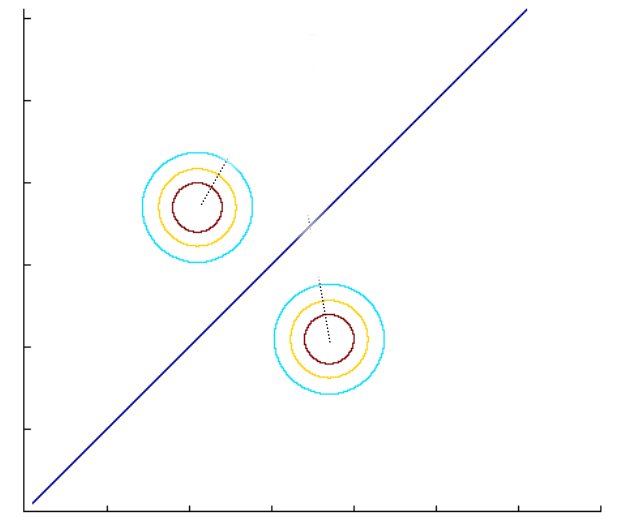

\title{Week-8: Naive Bayes and Gaussian Naive Bayes}
\author{Sherry Thomas \\ 21f3001449}

\maketitle
\tableofcontents

\begin{abstract}
This week's discussion revolves around the Naive Bayes algorithm for classification, with a comprehensive analysis of its benefits and limitations. Moreover, the session also covers the Gaussian Naive Bayes algorithm, delving into its specifics and applications.
\end{abstract}

# Generative Model Based Algorithm

A Generative Model Based Algorithm is an approach that seeks to model the probability distribution of the input data and generate new samples based on this distribution. The key idea involves learning the joint probability distribution of the features and labels in the training data and utilizing this learned model to make predictions for previously unseen data.

Let us consider a dataset $D=\{(\mathbf{x}_1, y_1), \ldots, (\mathbf{x}_n,y_n)\}$, where $\mathbf{x}_i \in \{0, 1\}^d$ and $y_i \in \{0, 1\}$.

The general steps of the algorithm are as follows:

1. Decide the labels by tossing a coin with $P(y_i=1)=p$.
2. Determine the features using the labels obtained in Step 1 through the conditional probability $P(\mathbf{x}_i|y_i)$.

\pagebreak
The parameters in the generative model are defined as follows:

1. Parameter $\hat{p}$ to decide the label: 1
2. Parameters for $P(\mathbf{x}|y=1)$: $2^d-1$
3. Parameters for $P(\mathbf{x}|y=0)$: $2^d-1$

Consequently, the total number of parameters is given by:
\begin{align*}
    & = 1 + (2^d-1) + (2^d-1) \\
    & = 1 + 2(2^d-1) \\
    & = 2^{d+1}-1
\end{align*}

**Issues**:

1. Too many parameters, which may lead to overfitting.
2. The model may not be practically viable due to the assumption made in the generative process.

## Alternate Generative Model

An alternative generative model starts with the class conditional independence assumption, which is a common assumption in various machine learning algorithms. This assumption states that the features of an object are conditionally independent given its class label.

Let us again consider the dataset $D=\{(\mathbf{x}_1, y_1), \ldots, (\mathbf{x}_n,y_n)\}$, with $\mathbf{x}_i \in \{0, 1\}^d$ and $y_i \in \{0, 1\}$.

The general steps of the algorithm under this alternative model are as follows:

1. Decide the labels by tossing a coin with $P(y_i=1)=p$.
2. Determine the features for $\mathbf{x}$ given $y$ using the following conditional probability:
$$
P(\mathbf{x} = [f_1, f_2, \ldots, f_d]|y) = \prod_{i=1}^d(p^{y_i}_i)^{f_i}(1-p^{y_i}_i)^{1-f_i}
$$

The parameters in this alternative model are as follows:

1. Parameter $\hat{p}$ to decide the label: 1
2. Parameters for $P(\mathbf{x}|y=1)$: $d$
3. Parameters for $P(\mathbf{x}|y=0)$: $d$

Thus, the total number of parameters is given by:
\begin{align*}
    & = 1 + d + d \\
    & = 2d + 1
\end{align*}

The parameters are estimated using Maximum Likelihood Estimation.

\pagebreak
# Naive Bayes Algorithm

The Naive Bayes algorithm is a classification algorithm based on Bayes' theorem, which assumes that the features are independent of each other given the class label. The model calculates the probability of a sample belonging to a class by estimating the conditional probability of each feature given the class and then combining these probabilities using Bayes' theorem. Despite its simple assumption, Naive Bayes has been found to perform well in various applications, particularly when the number of features is large but the training data is limited.

The model is given by:
$$
P(\mathbf{x} = [f_1, f_2, \ldots, f_d]|y) = \prod_{i=1}^d(p^{y_i}_i)^{f_i}(1-p^{y_i}_i)^{1-f_i}
$$

The parameters to be estimated are $p$, $\{p^0_1,p^0_2,\ldots,p^0_d\}$, and $\{p^1_1,p^1_2,\ldots,p^1_d\}$. Using Maximum Likelihood Estimation, we obtain the following estimates:
$$
\hat{p} = \frac{1}{n}\sum_{i=1}^ny_i
$$
\begin{align*}
\hat{p}^y_j & = \frac{\displaystyle \sum_{i=1}^n\mathbb{1}(f^i_j=1,y_i=y)}{\displaystyle \sum_{i=1}^n\mathbb{1}(y_i=y)} \hspace{1em} \text{for all } j \in \{1,2,\ldots,d\},\text{ and } \forall y \in \{0,1\}
\end{align*}

## Prediction using the parameters

Given $\mathbf{x}^{test}\in\{0,1\}^d$, the prediction for $\hat{y}^{test}$ is done using the following criterion:

$$
P(\hat{y}^{test}=1|\mathbf{x}^{test}) \ge P(\hat{y}^{test}=0|\mathbf{x}^{test})
$$

If the above inequality holds, then $\hat{y}^{test}=1$, otherwise $\hat{y}^{test}=0$.

Using Bayes' rule, we can express $P(\hat{y}^{test}=1|\mathbf{x}^{test})$ and $P(\hat{y}^{test}=0|\mathbf{x}^{test})$ as follows:

\begin{align*}
P(\hat{y}^{test}=1|\mathbf{x}^{test}) & = \frac{P(\mathbf{x}^{test}|\hat{y}^{test}=1)*P(\hat{y}^{test}=1)}{P(\mathbf{x}^{test})} \\
P(\hat{y}^{test}=0|\mathbf{x}^{test}) & = \frac{P(\mathbf{x}^{test}|\hat{y}^{test}=0)*P(\hat{y}^{test}=0)}{P(\mathbf{x}^{test})}
\end{align*}

However, since we are only interested in the comparison of these probabilities, we can avoid calculating $P(\mathbf{x}^{test})$.

\pagebreak
By solving for $P(\mathbf{x}^{test}|\hat{y}^{test}=1)*P(\hat{y}^{test}=1)$, we find:

\begin{align*}
&=P(\mathbf{x}^{test} = [f_1, f_2, \ldots, f_d]|y^{test}=1)*P(\hat{y}^{test}=1) \\
&=\left(\prod_{i=1}^d(\hat{p}^1_i)^{f_i}(1-\hat{p}^1_i)^{1-f_i}\right)*\hat{p}
\end{align*}

Similarly, we can obtain $P(\mathbf{x}^{test}|\hat{y}^{test}=0)*P(\hat{y}^{test}=0)$.

Therefore, we predict $\hat{y}^{test}=1$ if:

$$
\left(\prod_{i=1}^d(\hat{p}^1_i)^{f_i}(1-\hat{p}^1_i)^{1-f_i}\right)*\hat{p} \ge \left(\prod_{i=1}^d(\hat{p}^0_i)^{f_i}(1-\hat{p}^0_i)^{1-f_i}\right)*(1-\hat{p})
$$

Otherwise, we predict $\hat{y}^{test}=0$.

The Naive Bayes algorithm employs two main techniques:

1. The Class Conditional Independence Assumption.
2. Utilizing Bayes' Rule.

As a result, this algorithm is commonly referred to as Naive Bayes.

In summary, **Naive Bayes** is a classification algorithm based on Bayes' theorem, which assumes that the features are independent of each other given the class label. It estimates the conditional probabilities of features given the class and uses these probabilities to make predictions for new data. Despite its naive assumption, Naive Bayes has demonstrated good performance across various applications, particularly when dealing with high-dimensional data and limited training examples.

## Pitfalls of Naive Bayes

One prominent issue with Naive Bayes is that if a feature is not observed in the training set but present in the testing set, the prediction probabilities for both classes become zero.

\begin{align*}
P(\hat{y}^{test}=1|\mathbf{x}^{test} = [f_1, f_2, \ldots, f_d]) & \propto \left(\prod_{i=1}^d(\hat{p}^1_i)^{f_i}(1-\hat{p}^1_i)^{1-f_i}\right)*\hat{p} \\
P(\hat{y}^{test}=0|\mathbf{x}^{test} = [f_1, f_2, \ldots, f_d]) & \propto \left(\prod_{i=1}^d(\hat{p}^0_i)^{f_i}(1-\hat{p}^0_i)^{1-f_i}\right)*(1-\hat{p})
\end{align*}

If any feature $f_i$ was absent in the training set, it results in $\hat{p}^1_i=\hat{p}^0_i=0$, leading to $P(\hat{y}^{test}=0|\mathbf{x}^{test})=P(\hat{y}^{test}=1|\mathbf{x}^{test})=0$.

A popular remedy for this issue is to introduce two "pseudo" data points with labels 1 and 0, respectively, into the dataset, where all their features are set to 1. This technique is also known as Laplace smoothing.

In brief, **Laplace smoothing** is a technique employed to address the zero-frequency problem in probabilistic models, particularly in text classification. It involves adding a small constant value to the count of each feature and the number of unique classes to avoid zero probability estimates, which can cause problems during model training and prediction. By incorporating this smoothing term, the model becomes more robust and better suited for handling unseen data.

# Decision Function of Naive Bayes

Given $\mathbf{x}^{test}\in\{0,1\}^d$, the prediction for $\hat{y}^{test}$ is obtained using the following decision function:

\begin{multline*}\\
\frac{P(\hat{y}^{test}=1|\mathbf{x}^{test})}{P(\hat{y}^{test}=0|\mathbf{x}^{test})}\ge 1\\
\log \left (\frac{P(\hat{y}^{test}=1|\mathbf{x}^{test})}{P(\hat{y}^{test}=0|\mathbf{x}^{test})}\right )\ge 0\\
\log \left (\frac{\displaystyle\frac{P(\mathbf{x}^{test}|\hat{y}^{test}=1)*P(\hat{y}^{test}=1)}{P(\mathbf{x}^{test})}}{\displaystyle\frac{P(\mathbf{x}^{test}|\hat{y}^{test}=0)*P(\hat{y}^{test}=0)}{P(\mathbf{x}^{test})}}\right )\ge 0 \\
\log \left (\prod_{i=1}^d\frac{(\hat{p}^1_i)^{f_i}(1-\hat{p}^1_i)^{1-f_i}\hat{p}}{(\hat{p}^0_i)^{f_i}(1-\hat{p}^0_i)^{1-f_i}(1-\hat{p})}\right )\ge 0 \\
\log \left (\prod_{i=1}^d\left(\frac{\hat{p}^1_i}{\hat{p}^0_i}\right)^{f_i}\left(\frac{1-\hat{p}^1_i}{1-\hat{p}^0_i}\right)^{1-f_i}\frac{\hat{p}}{1-\hat{p}}\right )\ge 0 \\
\sum_{i=1}^d \left (f_i\log\left(\frac{\hat{p}^1_i}{\hat{p}^0_i}\right)+(1-f_i)\log\left(\frac{1-\hat{p}^1_i}{1-\hat{p}^0_i}\right)+\log\left(\frac{\hat{p}}{1-\hat{p}}\right)\right )\ge 0 \\
\sum_{i=1}^d \left (f_i\log\left(\frac{\hat{p}^1_i(1-\hat{p}^0_i)}{\hat{p}^0_i(1-\hat{p}^1_i)}\right)\right )+\sum_{i=1}^d\log\left(\frac{1-\hat{p}^1_i}{1-\hat{p}^0_i}\right)+\log\left(\frac{\hat{p}}{1-\hat{p}}\right)\ge 0
\end{multline*}

Thus, we can express the decision function as $w^T\mathbf{x}+b\ge0$, where $w\in\mathbb{R}^d$, $w_i=\displaystyle\log\left(\frac{\hat{p}^1_i(1-\hat{p}^0_i)}{\hat{p}^0_i(1-\hat{p}^1_i)}\right)$, and $b=\displaystyle\sum_{i=1}^d\log\left(\frac{1-\hat{p}^1_i}{1-\hat{p}^0_i}\right)+\log\left(\frac{\hat{p}}{1-\hat{p}}\right)$.

Consequently, the decision function of Naive Bayes is **linear**.

The decision boundary is given by $\{\mathbf{x}=P(y=1|\mathbf{x})=P(y=0|\mathbf{x})\}$.

\pagebreak
# Gaussian Naive Bayes

Gaussian Naive Bayes, also known as Gaussian Discriminant Analysis (GDA) or Gaussian Discriminant Analysis Naive Bayes (GDANB), represents a variant of the Naive Bayes algorithm designed for classification tasks. This approach assumes that the features in the dataset follow a Gaussian (normal) distribution and computes the likelihood of a class for a given set of feature values by estimating the mean and variance of the feature values within each class.

Consider a dataset, D, comprising data points in the form of pairs $\{(\mathbf{x}_1, y_1), \ldots, (\mathbf{x}_n,y_n)\}$, where $\mathbf{x}_i \in \mathbb{R}^d$ represents the feature vector and $y_i \in \{0, 1\}$ denotes the class label.

Let $P(\mathbf{x}|y=1)\sim\mathcal{N}(\boldsymbol{\mu}_1,\boldsymbol{\Sigma})$ and $P(\mathbf{x}|y=0)\sim\mathcal{N}(\boldsymbol{\mu}_0,\boldsymbol{\Sigma})$, with the assumption that the covariance matrices are equal.

To estimate the parameters, we need to find values for $\hat{p}$, $\boldsymbol{\mu}_0$, $\boldsymbol{\mu}_1$, and $\boldsymbol{\Sigma}$. Using Maximum Likelihood Estimation, we obtain the following results:

\begin{align*} 
\hat{p} &= \frac{1}{n}\sum_{i=1}^n y_i \\
\hat{\boldsymbol{\mu}}_1 &= \frac{\displaystyle \sum_{i=1}^n \mathbb{1}(y_i=1)*\mathbf{x}_i}{\displaystyle \sum_{i=1}^n \mathbb{1}(y_i=1)} \\
\hat{\boldsymbol{\mu}}_0 &= \frac{\displaystyle \sum_{i=1}^n \mathbb{1}(y_i=0)*\mathbf{x}_i}{\displaystyle \sum_{i=1}^n \mathbb{1}(y_i=0)} \\
\hat{\boldsymbol{\Sigma}} &= \frac{1}{n} \displaystyle \sum_{i=1}^n (\mathbf{x}_i-\hat{\boldsymbol{\mu}}_{y_i})(\mathbf{x}_i-\hat{\boldsymbol{\mu}}_{y_i})^T
\end{align*}

In the above equations, $\hat{p}$ represents the proportion of data points labeled 1, $\hat{\boldsymbol{\mu}}_1$ is the sample mean of data points labeled 1, $\hat{\boldsymbol{\mu}}_0$ is the sample mean of data points labeled 0, and $\hat{\boldsymbol{\Sigma}}$ is the covariance matrix of the centered dataset.

\pagebreak
## Prediction using Bayes' Rule

Prediction is based on the following equation:
$$
P(y_{test}=1|\mathbf{x}_{test})\propto P(\mathbf{x}_{test}|y_{test})*P(y_{test})
$$

Where $P(\mathbf{x}_{test}|y_{test})\equiv f(\mathbf{x}_{test};\hat{\boldsymbol{\mu}}_{y_{test}}, \hat{\boldsymbol{\Sigma}})$ and $P(y_{test})\equiv \hat{p}$.

To predict $y_{test}=1$, we compare the probabilities:

\begin{align*}
f(\mathbf{x}_{i} ;\hat{\boldsymbol{\mu} }_{1} ,\hat{\boldsymbol{\Sigma} }_{1} )\hat{p} & \geq f(\mathbf{x}_{i} ;\hat{\boldsymbol{\mu} }_{0} ,\hat{\boldsymbol{\Sigma} }_{0} )(1-\hat{p} )\\
e^{-(\mathbf{x}_{i} -\hat{\boldsymbol{\mu} }_{1} )^{T}\hat{\boldsymbol{\Sigma} }_{1}^{-1} (\mathbf{x}_{i} -\hat{\boldsymbol{\mu} }_{1} )}\hat{p} & \geq e^{-(\mathbf{x}_{i} -\hat{\boldsymbol{\mu} }_{0} )^{T}\hat{\boldsymbol{\Sigma} }_{0}^{-1} (\mathbf{x}_{i} -\hat{\boldsymbol{\mu} }_{0} )} (1-\hat{p} )\\
-(\mathbf{x}_{i} -\hat{\boldsymbol{\mu} }_{1} )^{T}\hat{\boldsymbol{\Sigma} }_{1}^{-1} (\mathbf{x}_{i} -\hat{\boldsymbol{\mu} }_{1} )+\log (\hat{p} ) & \geq -(\mathbf{x}_{i} -\hat{\boldsymbol{\mu} }_{0} )^{T}\hat{\boldsymbol{\Sigma} }_{0}^{-1} (\mathbf{x}_{i} -\hat{\boldsymbol{\mu} }_{0} )+\log (1-\hat{p} )
\end{align*}

This inequality can be expressed as a linear decision function:

$$
\left( (\hat{\boldsymbol{\mu}}_1-\hat{\boldsymbol{\mu}}_0)^T\hat{\boldsymbol{\Sigma}}^{-1} \right)\mathbf{x}_{test} + \hat{\boldsymbol{\mu}}_0^T\hat{\boldsymbol{\Sigma}}^{-1}\hat{\boldsymbol{\mu}}_0 - \hat{\boldsymbol{\mu}}_1^T\hat{\boldsymbol{\Sigma}}^{-1}\hat{\boldsymbol{\mu}}_1 + \log(\frac{1-\hat{p}}{\hat{p}}) \ge 0
$$

Thus, the decision function of Gaussian Naive Bayes is **linear**.

\pagebreak
## Decision Boundaries for Different Covariances

1. **When the covariance matrices are equal for both classes**: As previously discussed, the decision boundary is linear.

2. **When the covariance matrices are Identity matrices for both classes**: The decision boundary is both linear and the perpendicular bisector of the line drawn from $\hat{\boldsymbol{\mu}}_1$ to $\hat{\boldsymbol{\mu}}_0$.

3. **When the covariance matrices are not equal for both classes**: Let $\hat{\boldsymbol{\Sigma}}_1$ and $\hat{\boldsymbol{\Sigma}}_0$ be the covariance matrices for classes 1 and 0, respectively. They are given by,
\begin{align*} 
\hat{\boldsymbol{\Sigma}}_1 &= \frac{\displaystyle \sum_{i=1}^n(\mathbb{1}(y_i=1)*\mathbf{x}_i-\hat{\boldsymbol{\mu}}_1)(\mathbb{1}(y_i=1)*\mathbf{x}_i-\hat{\boldsymbol{\mu}}_1)^T}{\displaystyle \sum_{i=1}^n\mathbb{1}(y_i=1)} \\
\hat{\boldsymbol{\Sigma}}_0 &= \frac{\displaystyle \sum_{i=1}^n(\mathbb{1}(y_i=0)*\mathbf{x}_i-\hat{\boldsymbol{\mu}}_0)(\mathbb{1}(y_i=0)*\mathbf{x}_i-\hat{\boldsymbol{\mu}}_0)^T}{\displaystyle \sum_{i=1}^n\mathbb{1}(y_i=0)}
\end{align*}
To predict $y_{test}=1$, we compare the probabilities:
\begin{align*}
f(\mathbf{x}_{test};\hat{\boldsymbol{\mu}}_1, \hat{\boldsymbol{\Sigma}}_1)*\hat{p}&\ge f(\mathbf{x}_{test};\hat{\boldsymbol{\mu}}_0, \hat{\boldsymbol{\Sigma}}_0)*(1-\hat{p}) \\
e^{-(\mathbf{x}_{test}-\hat{\boldsymbol{\mu}}_1)^T\hat{\boldsymbol{\Sigma}}_1(\mathbf{x}_{test}-\hat{\boldsymbol{\mu}}_1)}*\hat{p}&\ge e^{-(\mathbf{x}_{test}-\hat{\boldsymbol{\mu}}_0)^T\hat{\boldsymbol{\Sigma}}_1(\mathbf{x}_{test}-\hat{\boldsymbol{\mu}}_0)}*(1-\hat{p}) \\
-(\mathbf{x}_{test}-\hat{\boldsymbol{\mu}}_1)^T\hat{\boldsymbol{\Sigma}}_1(\mathbf{x}_{test}-\hat{\boldsymbol{\mu}}_1)+\log(\hat{p})&\ge -(\mathbf{x}_{test}-\hat{\boldsymbol{\mu}}_0)^T\hat{\boldsymbol{\Sigma}}_0(\mathbf{x}_{test}-\hat{\boldsymbol{\mu}}_0) + \log(1-\hat{p}) \\
\end{align*}
This inequality leads to a quadratic decision function:
$$
\mathbf{x}_{test}^T(\hat{\boldsymbol{\Sigma}}_1^{-1}-\hat{\boldsymbol{\Sigma}}_0^{-1})\mathbf{x}_{test}-2(\hat{\boldsymbol{\mu}}_1^T\hat{\boldsymbol{\Sigma}}_1^{-1}-\hat{\boldsymbol{\mu}}_0^T\hat{\boldsymbol{\Sigma}}_0^{-1})\mathbf{x}_{test}+(\hat{\boldsymbol{\mu}}_0^T\hat{\boldsymbol{\Sigma}}_0^{-1}\hat{\boldsymbol{\mu}}_0-\hat{\boldsymbol{\mu}}_1^T\hat{\boldsymbol{\Sigma}}_1^{-1}\hat{\boldsymbol{\mu}}_1) + \log(\frac{1-\hat{p}}{\hat{p}}) \ge 0
$$
Hence, the decision boundary is a quadratic function when the covariance matrices are not equal for both classes.

# Acknowledgments

**Professor Arun Rajkumar**: The content, including the concepts and notations presented in this document, has been sourced from his slides and lectures. His expertise and educational materials have greatly contributed to the development of this document.
